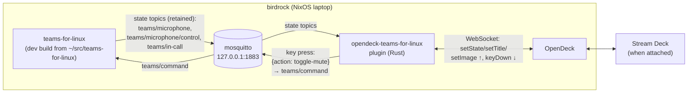
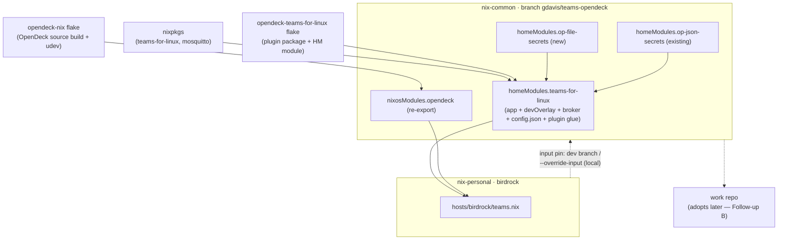
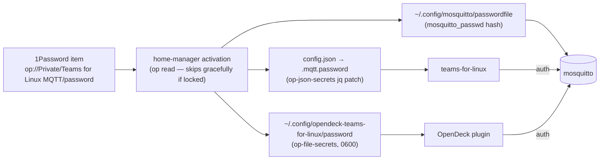

# teams-for-linux + OpenDeck shared module — Design

**Date:** 2026-06-05
**Status:** Approved
**Repos:** nix-common (implementation, branch `gdavis/teams-opendeck`) + nix-personal (consumer, matching branch)

## Context

The teams-for-linux MQTT mute-button stack currently exists only on the work
machine, configured by a private module in the work consumer repo: teams config
with MQTT, a localhost mosquitto broker, 1Password-sourced secrets, and a
Stream Deck plugin. The plugin has since been extracted and published as
[opendeck-teams-for-linux](https://github.com/geoffdavis/opendeck-teams-for-linux)
(v0.1.0, flake with a home-manager module).

Goal: install the full stack on birdrock (personal NixOS laptop) — the **dev
build** of teams-for-linux from `~/src/teams-for-linux` (the MQTT-features PR
branch) plus **OpenDeck** (not in nixpkgs) — implemented as a **shared
nix-common module** that the work repo can adopt later (its planned migration
onto the published plugin flake).

## Runtime overview



## Decisions (settled during brainstorming)

| Decision | Choice |
|----------|--------|
| Code home | nix-common shared module (consumed by nix-personal now, work repo later) |
| OpenDeck source | [`Kitt3120/opendeck-nix`](https://github.com/Kitt3120/opendeck-nix) flake (source build of v2.12.x, NixOS module with udev rules). Flatpak rejected: sandbox breaks the plugin's `~/.config/opendeck/plugins/` path. AppImage wrap kept as fallback if the flake goes stale. |
| teams-for-linux install | nixpkgs package as base + `devOverlay` toggle swapping in the local checkout build (parity with the work module's pattern) |
| Broker auth | 1Password-sourced password (new "Teams for Linux MQTT" item in the Private vault); localhost-only mosquitto |
| Hardware | Stream Deck only sometimes present → install udev rules unconditionally; hardware verification happens when a deck is plugged in |
| Rollout | Dev branches: nix-common `gdavis/teams-opendeck`; nix-personal pins its `nix-common` input to that branch (or `--override-input` to the local checkout during iteration); merge common first, then `task bump:common` + merge personal |

## nix-common changes



### New flake inputs

```nix
opendeck-nix.url = "github:Kitt3120/opendeck-nix";
# Deliberately NO nixpkgs follows — upstream README warns of hash mismatches.

opendeck-teams-for-linux.url = "github:geoffdavis/opendeck-teams-for-linux";
opendeck-teams-for-linux.inputs.nixpkgs.follows = "nixpkgs-nixos";
```

### New exports

1. **`nixosModules.opendeck`** — re-export of `opendeck-nix.nixosModules.default`
   (`programs.opendeck.enable` → package in systemPackages + udev rules via
   `services.udev.packages`).

2. **`homeModules.op-file-secrets`** — generic sibling of `op-json-secrets`:

   ```nix
   op-file-secrets = [
     { dest = "/abs/path"; ref = "op://Vault/Item/field"; mode = "0600"; }
   ];
   ```

   Activation writes `op read <ref>` output (trailing newline stripped) to
   `dest` with `mode` (default `0600`), creating parent dirs. Same
   degradation contract as op-json-secrets: skip with a warning when `op` is
   missing or a read fails; never fail the switch.

3. **`homeModules.teams-for-linux`** — exported as
   `import ./modules/home/teams-for-linux.nix inputs` (the module needs the
   two new inputs). Options, namespaced `teams-for-linux.*` (work-module
   parity):

   | Option | Default | Meaning |
   |--------|---------|---------|
   | `enable` | — | master switch |
   | `package` | `pkgs.teams-for-linux` | base app |
   | `devOverlay.enable` | `false` | use the local dev build instead |
   | `devOverlay.checkoutPath` | `"${home}/src/teams-for-linux"` | git checkout; build first with `npm run pack` |
   | `mqtt.enable` | `true` | broker + config.json mqtt section + secrets |
   | `mqtt.username` | `"teams-for-linux"` | broker user |
   | `mqtt.passwordRef` | — (required when mqtt.enable) | `op://…` URI |
   | `mqtt.topicPrefix` / `statusTopic` / `commandTopic` / `mediaTopics.*` | upstream defaults (`teams`, `status`, `command`, `in-call`/`incoming-call`/`camera`/`microphone`/`microphone/control`/`screen-sharing`) | topic layout |
   | `opendeckPlugin.enable` | `false` | wire the published plugin |
   | `extraConfig` | `{}` | host-specific config.json keys (e.g. `disableGpu`, `auth.reauthRecovery`) |

   Behavior when enabled:

   - **Packages:** `package` (omitted when devOverlay) + `mosquitto` on
     `home.packages`.
   - **devOverlay:** `writeShellScriptBin "teams-for-linux"` exec'ing
     `<checkout>/dist/linux-unpacked/teams-for-linux
     --user-data-dir=~/.config/teams-for-linux "$@"`, plus a
     `~/.local/share/applications/teams-for-linux.desktop` override (ports the
     work module's wrapper verbatim, including the StartupWMClass and
     msteams MimeType).
   - **Broker:** mosquitto user systemd service; conf: localhost:1883,
     `allow_anonymous false`, `password_file ~/.config/mosquitto/passwordfile`,
     persistence off.
   - **config.json:** an activation step jq-merges the module-owned,
     non-secret keys (mqtt block sans password, plus `extraConfig`) into
     `~/.config/teams-for-linux/config.json`, preserving unknown keys; an
     `op-json-secrets` entry patches `.mqtt.password` from `passwordRef`.
   - **Broker passwordfile:** dedicated activation step (`op read` +
     `mosquitto_passwd -b -c`) — hashing means op-file-secrets cannot produce
     this file. Skips gracefully without `op`.
   - **opendeckPlugin.enable:** imports
     `opendeck-teams-for-linux.homeManagerModules.default`, sets
     `programs.opendeck-teams-for-linux.enable = true` and `settings` =
     username + `password_file = ~/.config/opendeck-teams-for-linux/password`
     (registered via op-file-secrets from the same `passwordRef`) + topic
     prefix/suffix values mirroring `mqtt.*` so app and plugin can never
     drift apart.

### Secrets flow



## nix-personal changes (birdrock)

- `hosts/birdrock/teams.nix`:
  - NixOS: import `nix-common.nixosModules.opendeck`; `programs.opendeck.enable = true`.
  - home-manager: import `nix-common.homeModules.teams-for-linux` (and
    `op-file-secrets` if not auto-imported); set:

    ```nix
    teams-for-linux = {
      enable = true;
      devOverlay.enable = true;
      mqtt.passwordRef = "op://Private/Teams for Linux MQTT/password";
      opendeckPlugin.enable = true;
    };
    ```
- **Manual prerequisite (Geoff):** create the 1Password item
  `Teams for Linux MQTT` in the Private vault with a generated password.

## Rollout

1. nix-common: implement on branch `gdavis/teams-opendeck`, push.
2. nix-personal: branch `gdavis/teams-opendeck`; pin
   `nix-common.url = "github:geoffdavis/nix-common/gdavis/teams-opendeck"`.
   During local iteration prefer
   `sudo nixos-rebuild switch --flake .#birdrock --override-input nix-common
   ~/src/nix/nix-common` (no push round-trips).
3. After verification: squash-merge nix-common; on nix-personal run
   `task bump:common` (restores canonical URL + verify-pin sync), squash-merge.

First rebuild pays a one-time OpenDeck Tauri source build (no binary cache
for that flake; its dependency closure comes from the nixpkgs cache).

## Verification (on birdrock, in order)

1. `npm run pack` in `~/src/teams-for-linux` (dev binary must exist).
2. Rebuild via override-input; activation reports config.json patch,
   mosquitto passwordfile, and plugin password file (all 0600).
3. `systemctl --user status mosquitto` active;
   `mosquitto_sub -u teams-for-linux -P "$(cat ~/.config/opendeck-teams-for-linux/password)" -t 'teams/#' -v`
   connects and stays up.
4. teams-for-linux launches from the desktop entry (dev binary); logs MQTT
   connect; `teams/status` messages flow.
5. OpenDeck launches and lists the plugin. With a deck attached: place the
   button, observe SETUP→OFF, then a test call for MIC/MUTED + press-to-toggle.
   Without a deck: verify the plugin process starts in OpenDeck's logs;
   button placement waits for hardware.
6. Success retires "Follow-up A" (hardware smoke test) for the published
   plugin, modulo the deck-attached steps whenever one is next plugged in.

## Error handling / boundaries

- Every op-dependent activation step skips with a warning (never fails the
  switch) when `op` or the vault session is unavailable — stale secrets, not
  broken rebuilds.
- The module owns only the config.json keys it writes (mqtt block +
  `extraConfig`); all other keys in the file are preserved (jq-merge).
- Out of scope: the work-repo migration (its Follow-up B) — but this module
  is the shared artifact that migration will adopt; its option surface
  deliberately covers the work module's needs (devOverlay, extraConfig,
  topic overrides).

## Future ideas (out of scope)

- AppImage-wrap fallback for OpenDeck if `opendeck-nix` goes stale
  (`appimageTools.wrapType2` + nvfetcher pin; identical consumption surface).
- Work-repo adoption (Follow-up B in the plugin repo's docs).
